# FFIMS Model Relationships

This map shows the main collection relationships for the FFIMS MongoDB backend. In Mongoose, these are represented with `ObjectId` references and bridge collections for many-to-many links.

## Core One-To-Many Relationships

- `Role` 1:M `User`
- `User` 1:M `UserSession`
- `User` 1:M `PasswordResetToken`
- `User` 1:M `AuditLog`
- `User` 1:M `Asset` through `createdBy`
- `User` 1:M `Vehicle` through `createdBy`
- `User` 1:M `Project` through `createdBy`
- `User` 1:M `ShiftSchedule`
- `User` 1:M `Booking`
- `User` 1:M `Bill`
- `User` 1:M `ProcurementRequest`
- `User` 1:M `FaultTicket`
- `User` 1:M `ComplianceRecord`

- `FacilityCategory` 1:M `Facility`
- `AssetLocation` 1:M `Facility`
- `AssetLocation` 1:M `InventoryItem`
- `AssetLocation` 1:M `Asset`
- `Facility` 1:M `Room`
- `Facility` 1:M `Equipment`
- `Facility` 1:M `Asset`
- `Facility` 1:M `FacilityHealthRecord`
- `Facility` 1:M `FacilityAssetCondition`
- `Facility` 1:M `FacilityUtilityMetric`
- `Facility` 1:M `FacilityScoreBreakdown`
- `Facility` 1:M `FacilityThresholdRule`
- `Facility` 1:M `FacilityWorkOrder`
- `Facility` 1:M `FacilityActivityLog`
- `Facility` 1:M `Booking`
- `Facility` 1:M `ProcurementRequest`
- `Facility` 1:M `Project`
- `Facility` 1:M `FaultTicket`
- `Facility` 1:M `ShiftSchedule`
- `Facility` 1:M `ComplianceRecord`

- `AssetCategory` 1:M `Asset`
- `Supplier` 1:M `Asset`
- `Supplier` 1:M `InventoryItem`
- `Supplier` 1:M `ProcurementRequest`
- `Supplier` 1:M `VehicleMaintenance`
- `Supplier` 1:M `ComplianceRecord`
- `Asset` 1:M `AssetDocument`
- `Asset` 1:M `AssetValuation`
- `Asset` 1:M `AssetTransaction`
- `Asset` 1:M `MaintenanceTask`
- `Asset` 1:M `MaintenanceHistory`
- `Asset` 1:M `RecurringTask`
- `Asset` 1:M `FaultTicket`
- `Asset` 1:M `FacilityWorkOrder`
- `Asset` 1:M `ComplianceRecord`

- `Driver` 1:M `Trip`
- `Driver` 1:M `Incident`
- `Driver` 1:M `DutyAssignment`
- `Driver` 1:M `Vehicle` through `assignedDriverId`
- `Driver` 1:M `ShiftSchedule`

- `Vehicle` 1:M `Trip`
- `Vehicle` 1:M `FuelRecord`
- `Vehicle` 1:M `VehicleMaintenance`
- `Vehicle` 1:M `VehicleDocument`
- `Vehicle` 1:M `Incident`
- `Vehicle` 1:M `DutyAssignment`
- `Vehicle` 1:M `MaintenanceTask`
- `Vehicle` 1:M `FaultTicket`
- `Vehicle` 1:M `ComplianceRecord`

- `Booking` 1:M `BookingApproval`
- `Booking` 1:M `Bill`
- `Booking` 1:M `FaultTicket`

- `Bill` 1:M `BillItem`
- `Bill` 1:M `Payment`

- `Project` 1:M `ProjectTask`
- `Project` 1:M `Booking`
- `Project` 1:M `Bill`
- `Project` 1:M `ProcurementRequest`
- `Project` 1:M `FaultTicket`
- `Project` 1:M `ShiftSchedule`
- `Project` 1:M `ComplianceRecord`
- `Project` 1:M `FacilityWorkOrder`

- `FacilityWorkOrder` 1:M `VehicleMaintenance`
- `FacilityWorkOrder` 1:M `MaintenanceTask`
- `FacilityWorkOrder` 1:M `FaultTicket`
- `FacilityWorkOrder` 1:M `ProjectTask`

- `FaultTicket` 1:M `Incident`
- `FaultTicket` 1:M `MaintenanceTask`
- `FaultTicket` 1:M `FacilityWorkOrder`
- `FaultTicket` 1:M `ProjectTask`
- `FaultTicket` 1:M `ComplianceRecord`

- `ProcurementRequest` 1:M `ProcurementRequestItem`

## Many-To-Many Relationships

- `Facility` M:N `FacilityNavigationGroup` through `FacilityGroupMember`
- `Booking` M:N `Equipment` through `BookingEquipment`
- `Supplier` M:N `InventoryItem` through `SupplierItem`
- `VehicleMaintenance` M:N `InventoryItem` through `MaintenancePartUsage`
- `Driver` M:N `Vehicle` through `DutyAssignment`
- `Project` M:N `User` through `ProjectTeamMember`
- `FaultTicket` M:N `User` through `TicketAssignment`
- `ComplianceRecord` M:N `User` through `ComplianceAssignment`
- `ProcurementRequest` M:N `InventoryItem` through `ProcurementRequestItem`

## Module Connectivity Summary

- Authentication connects into every operational module through `User`, `Role`, `AuditLog`, `UserSession`, and `PasswordResetToken`.
- Fleet management connects to maintenance, inventory, ticketing, compliance, and shifts through `Vehicle`, `Driver`, `VehicleMaintenance`, `MaintenancePartUsage`, `Incident`, and `ShiftSchedule`.
- Asset register and lifecycle connect to facilities, suppliers, maintenance, work orders, ticketing, and compliance through `Asset`.
- Facilities monitoring and utilities connect to maintenance, bookings, projects, ticketing, compliance, and scheduling through `Facility`.
- Maintenance planning and scheduling connects assets, vehicles, facilities, work orders, tickets, inventory, and projects through `MaintenanceTask`, `VehicleMaintenance`, `RecurringTask`, and `MaintenanceHistory`.
- Inventory and stores connect procurement, suppliers, and maintenance through `InventoryItem`, `SupplierItem`, `ProcurementRequestItem`, and `MaintenancePartUsage`.
- Events and venue booking connect facilities, rooms, equipment, billing, and tickets through `Booking`, `Room`, `Equipment`, `BookingEquipment`, `Bill`, and `Payment`.
- Project management and work coordination connect users, facilities, tickets, work orders, bookings, billing, procurement, and shifts through `Project`, `ProjectTeamMember`, and `ProjectTask`.
- Compliance and safety management connect users, facilities, assets, vehicles, suppliers, tickets, and projects through `ComplianceRecord` and `ComplianceAssignment`.

## Mermaid ER Diagram

```mermaid
erDiagram
  ROLE ||--o{ USER : assigns
  USER ||--o{ USER_SESSION : logs
  USER ||--o{ PASSWORD_RESET_TOKEN : resets
  USER ||--o{ AUDIT_LOG : creates

  FACILITY_CATEGORY ||--o{ FACILITY : classifies
  ASSET_LOCATION ||--o{ FACILITY : locates
  ASSET_LOCATION ||--o{ ASSET : stores
  ASSET_LOCATION ||--o{ INVENTORY_ITEM : stores
  FACILITY ||--o{ ROOM : contains
  FACILITY ||--o{ EQUIPMENT : owns
  FACILITY ||--o{ ASSET : hosts
  FACILITY ||--o{ FACILITY_WORK_ORDER : raises
  FACILITY ||--o{ FACILITY_UTILITY_METRIC : measures

  ASSET_CATEGORY ||--o{ ASSET : classifies
  SUPPLIER ||--o{ ASSET : supplies
  SUPPLIER ||--o{ INVENTORY_ITEM : supplies
  ASSET ||--o{ MAINTENANCE_TASK : requires
  ASSET ||--o{ ASSET_DOCUMENT : has
  ASSET ||--o{ ASSET_TRANSACTION : tracks

  DRIVER ||--o{ TRIP : drives
  VEHICLE ||--o{ TRIP : serves
  VEHICLE ||--o{ VEHICLE_MAINTENANCE : requires
  VEHICLE ||--o{ INCIDENT : involved_in

  BOOKING }o--|| ROOM : reserves
  BOOKING ||--o{ BOOKING_APPROVAL : approves
  BOOKING ||--o{ BILL : bills
  BOOKING ||--o{ BOOKING_EQUIPMENT : requests
  EQUIPMENT ||--o{ BOOKING_EQUIPMENT : allocates

  PROJECT ||--o{ PROJECT_TASK : contains
  PROJECT ||--o{ PROJECT_TEAM_MEMBER : staffs
  USER ||--o{ PROJECT_TEAM_MEMBER : joins

  FAULT_TICKET ||--o{ TICKET_ASSIGNMENT : assigns
  USER ||--o{ TICKET_ASSIGNMENT : handles

  PROCUREMENT_REQUEST ||--o{ PROCUREMENT_REQUEST_ITEM : contains
  INVENTORY_ITEM ||--o{ PROCUREMENT_REQUEST_ITEM : requests
  SUPPLIER ||--o{ SUPPLIER_ITEM : offers
  INVENTORY_ITEM ||--o{ SUPPLIER_ITEM : catalogs

  VEHICLE_MAINTENANCE ||--o{ MAINTENANCE_PART_USAGE : uses
  INVENTORY_ITEM ||--o{ MAINTENANCE_PART_USAGE : consumed

  COMPLIANCE_RECORD ||--o{ COMPLIANCE_ASSIGNMENT : assigns
  USER ||--o{ COMPLIANCE_ASSIGNMENT : responsible_for
```

